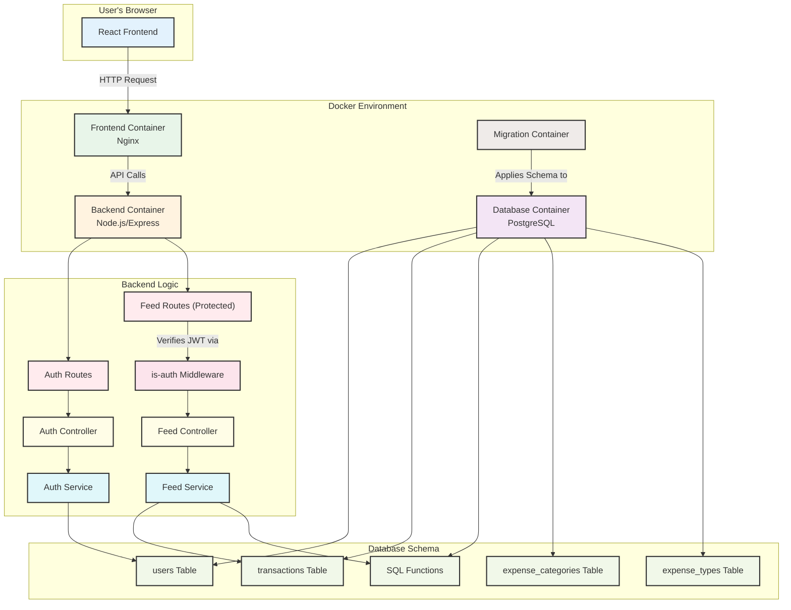
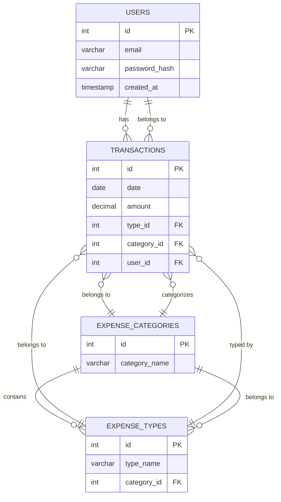

# Personal Finance Tracker

A full-stack, containerized personal finance management app built with React, Node.js/Express, TypeScript, PostgreSQL, and Docker Compose.

---

## Table of Contents
- [Overview](#overview)
- [Features](#features)
- [System Architecture](#system-architecture)
- [Data Model](#data-model)
- [Setup & Installation](#setup--installation)
- [Usage](#usage)
- [Credits & Resources](#credits--resources)

---

## Overview
This project is a robust, user-friendly platform for tracking personal finances. It replaces complex spreadsheets with a modern dashboard, secure authentication, and insightful analytics. All components are containerized for easy deployment.

**Motivation:**
- Consolidate financial tracking into a single, efficient platform.
- Learn and apply best practices in full-stack development, security, and DevOps.

A detailed explanation of project's structure and core components are described in the following blogs:
NOTE: The code has been updated and the content might not contain some new tables and features but the core parts are still there
- [Blog: Database Setup](https://medium.com/towards-data-engineering/building-a-personal-finance-management-app-database-setup-with-postgresql-and-docker-5075e283303e)
- [Blog: REST API & Integration](https://medium.com/towards-data-engineering/building-a-personal-finance-management-app-integrating-rest-api-node-js-7a0f0f27bd4e)

---

## Features
- **User Authentication:** Secure signup/login with JWT and password hashing.
- **User-specific Data:** Each user's data is isolated and protected.
- **Expense & Income Tracking:** Add, view, and categorize transactions.
- **Responsive Dashboard:** Modern UI with charts (Recharts, MUI) and mobile-friendly design.
- **REST API:** Clean separation between frontend and backend.
- **Dockerized:** One-command setup for local or production.

---

## System Architecture



---

## Data Model

### Entity-Relationship Diagram



**Table Descriptions:**
- **users:** Stores user credentials and metadata. Each user has a unique email and securely hashed password.
- **transactions:** Records all income/expenses. Each transaction is linked to a user, a category, and a type.
- **expense_categories:** High-level groupings (e.g., Housing, Personal Running Costs).
- **expense_types:** Specific types within a category (e.g., Restaurants, Groceries).

---

## Setup & Installation

1. **Clone the repository:**
   ```sh
   git clone <repo-url>
   cd finance-tracker
   ```
2. **Start the stack:**
   ```sh
   docker-compose up -d
   ```
   - To rebuild: `docker-compose up --build`
   - To stop: `docker-compose down` (add `-v` to remove volumes)
3. **Access the app:**
   - Frontend: [http://localhost:3001](http://localhost:3001)
   - Backend/API: [http://localhost:3000](http://localhost:3000)

**Note:** Change the frontend port in `docker-compose.yaml` if 3001 is blocked.

---

## Usage
- **Sign up** for a new account.
- **Log in** to access your dashboard.
- **Add transactions** (income/expenses) via the dashboard modal.
- **View analytics** and charts for your financial overview.
- **Log out** securely; you'll be auto-logged out if your session expires.

---

## Credits & Resources
- Inspired by [ed-roh/finance-app](https://github.com/ed-roh/finance-app) and [this YouTube tutorial](https://www.youtube.com/watch?v=uoJ0Tv-BFcQ)
---

**Currency is hardcoded as Danish Crowns (DKK) in the frontend.**

**This project is a work in progress and intended for personal use.**
